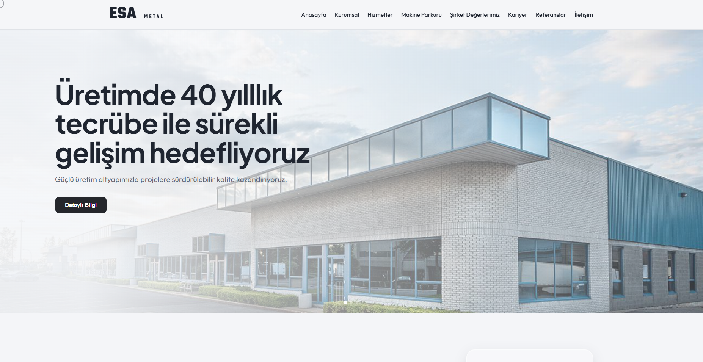

# ESA Metal - Corporate Web Solution

A high-performance corporate website designed and developed for the industrial sector. This project focuses on professional branding, SEO optimization, and a seamless user experience.

### 🚀 Features

- **Dynamic Content Management:** Custom-built admin panel for managing services and references.
- **Responsive Design:** Fully compatible with desktop, tablet, and mobile screens.
- **SEO Ready:** Optimized meta tags and semantic HTML structure for better search visibility.
- **Modern UI:** Clean and minimalist aesthetic tailored for industrial corporate identity.

### 🛠 Tech Stack

- **Backend:** PHP, MySQL
- **Frontend:** Bootstrap 5, JavaScript, CSS3, HTML5
- **Icons & Fonts:** FontAwesome, Google Fonts

### 📸 Preview

